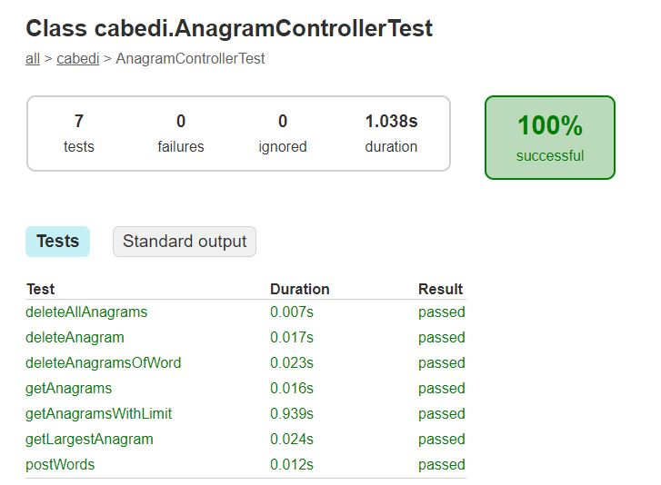

# Anagram Api

A Spring boot web api for serving anagrams of english words. On start up, it loads a text file containing the english 
dictionary, `src/main/resources/dictionary.txt`

### Built With

* [Spring Boot](https://spring.io/) - The web framework used
* [Gradle](https://gradle.org/) - Dependency Management

## Getting Started

These instructions will get you a copy of the project up and running on your local machine for development and testing purposes. See deployment for notes on how to deploy the project on a live system.

### Prerequisites

You will need to have [Java jdk12](https://www.oracle.com/technetwork/java/javase/downloads/jdk12-downloads-5295953.html) Installed

### Installing

The steps to get this system up and running are provided. You can use your own installation of gradle aswell, just remove the "w" from the next commands.
 To run inside intellij, Gradle version 4.x since the intellij plugin is dependent on it. 
 
The gradlew is [Gradle](https://gradle.org/) 4.9, as the spring boot Intellij plugin has a dependency on version 4.x. 
 

```
gradlew build
```

then 
```
gradlew run
```

The endpoints will be available at:

[localhost:8080/anagrams/listen.json](localhost:8080/anagrams/listen.json)

### Supported Routes
- `POST /words.json`: Takes a JSON array of English-language words and adds them to the corpus (data store).
- `GET /anagrams/:word.json`:
  - Returns a JSON array of English-language words that are anagrams of the word passed in the URL.
  - Supports an optional query param 'limit' that indicates the maximum number of results to return.
- `GET /anagrams/largest`: Returns the anagrams with the most words
- `DELETE /words/:word.json`: Deletes a single word from the data store.
- `DELETE /words.json`: Deletes all contents of the data store.
- `DELETE /words/remove/:word.json` Deletes a word and all of its anagrams


## Running the tests

There is a testing class under `src/test/java/cabedi/` that verifies the routes are working as intended. Along with that,
there is a ruby script that runs some more provided tests

you can run mvc tests provided with the command 

```
gradlew test
```

The results can be viewed in a html document by navigating to `build/reports/tests/test/classes/cabedi.AnagramControllerTest.html`



### Prerequisites

[Ruby](https://ruby-doc.org/)


Tests for this system were provided in ruby scripts. They are found in `src/test/resources`
and you can execute them with the command 
```
ruby anagram_test.rb
```

#### what do they test?

These tests test the endpoints response status as well as functionality of the web api

```
>ruby anagram_test.rb
Loaded suite anagram_test
Started
.......
Finished in 0.527031 seconds.
------------------------------------------------------------------------------------------------------------------------
7 tests, 20 assertions, 0 failures, 0 errors, 0 pendings, 0 omissions, 0 notifications
100% passed
------------------------------------------------------------------------------------------------------------------------
13.28 tests/s, 37.95 assertions/s
```

## Deployment

A [Heroku](https://heroku.com) CI/CD pipeline is watching, building and deploying off merges into the master branch at

https://anagram-api-chris.herokuapp.com/

